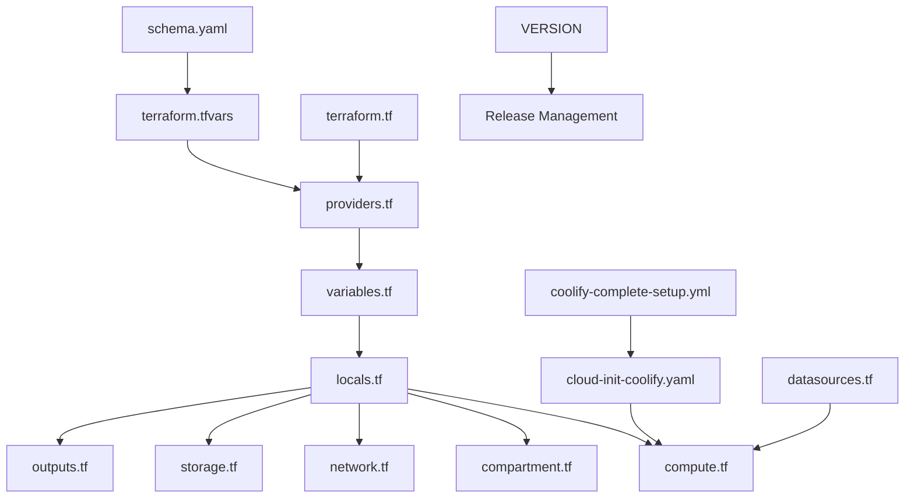

# VibeStack Coolify Deployment - File Mapping & Architecture

This document explains how all the files in the `deploy/coolify/` directory work together to create a complete, automated Coolify deployment on Oracle Cloud Infrastructure.

## File Overview & Relationships

## Detailed File Roles & Interactions

### 1. Configuration & Schema Files

#### `schema.yaml` (Configuration Schema)
- **Purpose**: Defines the deployment configuration schema for the "Deploy to Oracle Cloud" button
- **Contains**: Variable groups, validation rules, default values, and UI metadata
- **Used by**: Oracle Resource Manager (ORM) web interface
- **Relationships**:
  - Defines all input variables that users see in the deployment form
  - Groups variables into logical sections (Authentication, Compute, SSL, etc.)
  - Provides validation rules and default values
  - Maps to `variables.tf` for Terraform implementation

#### `terraform.tfvars.example` (Configuration Template)
- **Purpose**: Example configuration file showing all available options
- **Contains**: Commented examples of all Terraform variables
- **Used by**: Users to create their `terraform.tfvars` file
- **Relationships**:
  - Mirrors the schema from `schema.yaml`
  - Shows both required and optional configurations
  - Includes examples for Cloudflare tunnel and SSL certificate setup

### 2. Terraform Core Files

#### `providers.tf` (Provider Configuration)
- **Purpose**: Configures the Oracle Cloud Infrastructure (OCI) Terraform provider
- **Contains**: Provider version constraints and authentication setup
- **Used by**: All Terraform resources
- **Relationships**:
  - Defines required OCI provider version (5.10.0 to <7.20.0)
  - Sets up authentication using variables from `variables.tf`

#### `variables.tf` (Input Variables)
- **Purpose**: Defines all Terraform input variables with validation
- **Contains**: 25+ variables covering authentication, compute, networking, and optional features
- **Used by**: All Terraform resources and `locals.tf`
- **Relationships**:
  - Implements the schema defined in `schema.yaml`
  - Provides validation rules for all inputs
  - Supplies values to `locals.tf` for computed values

#### `locals.tf` (Computed Values & Logic)
- **Purpose**: Contains computed values, resource naming logic, and conditional configurations
- **Contains**: Resource names, security rules, Cloudflare config, SSL processing
- **Used by**: All resource files (compute.tf, network.tf, etc.)
- **Relationships**:
  - Processes variables into usable formats
  - Generates unique resource names with suffixes
  - Handles conditional logic for optional features
  - Creates base64-encoded SSL certificates for cloud-init

#### `terraform.tf` (Terraform Settings)
- **Purpose**: Defines Terraform version requirements and backend configuration
- **Contains**: Required Terraform version and provider requirements
- **Used by**: Terraform CLI during initialization
- **Relationships**:
  - Ensures compatibility with Terraform 1.5.0+
  - Defines required providers (currently only OCI)

### 3. Infrastructure Resource Files

#### `compartment.tf` (Identity Management)
- **Purpose**: Creates the OCI compartment to contain all VibeStack resources
- **Contains**: Single compartment resource with delete enabled
- **Used by**: All other resources (provides compartment_id)
- **Relationships**:
  - Creates isolated namespace for the deployment
  - Allows clean resource organization and deletion

#### `network.tf` (Network Infrastructure)
- **Purpose**: Creates VCN, subnet, security lists, internet gateway, and routing
- **Contains**: Complete network stack for Always Free tier
- **Used by**: `compute.tf` (provides subnet_id)
- **Relationships**:
  - Uses locals from `locals.tf` for naming and security rules
  - Creates public subnet with security list allowing required ports
  - Sets up internet gateway and routing for public access

#### `compute.tf` (Virtual Machine)
- **Purpose**: Creates the Ubuntu server instance with Coolify
- **Contains**: OCI instance configuration with cloud-init user data
- **Used by**: Final deployment (provides server access)
- **Relationships**:
  - References network resources from `network.tf`
  - Uses cloud-init script from `cloud-init-coolify.yaml`
  - Passes computed values from `locals.tf` as template variables

#### `storage.tf` (Block Storage)
- **Purpose**: Creates additional block volume for Coolify data persistence
- **Contains**: Block volume and attachment configuration
- **Used by**: Coolify for persistent data storage
- **Relationships**:
  - Attaches to compute instance from `compute.tf`
  - Provides 100GB default storage for Coolify applications and databases

#### `datasources.tf` (Data Sources)
- **Purpose**: Retrieves dynamic OCI information (availability domains, images)
- **Contains**: Data sources for AD selection and Ubuntu image lookup
- **Used by**: `compute.tf` and `locals.tf`
- **Relationships**:
  - Dynamically selects first available availability domain
  - Finds latest Ubuntu 22.04 ARM64 image for Ampere A1 instances

### 4. Cloud-Init & Automation Files

#### `cloud-init-coolify.yaml` (Server Bootstrap)
- **Purpose**: Configures the Ubuntu server during first boot
- **Contains**: DNS setup, package installation, Ansible deployment
- **Used by**: `compute.tf` (passed as base64-encoded user_data)
- **Relationships**:
  - Receives template variables from Terraform (SSL certs, Cloudflare config)
  - Downloads and executes the Ansible playbook
  - Sets up environment for automated Coolify installation

### 5. Ansible Automation

#### `coolify-complete-setup.yml` (Application Installation)
- **Purpose**: Complete Coolify installation and configuration playbook
- **Contains**: Docker setup, Coolify installer, SSL config, Cloudflare tunnel
- **Used by**: `cloud-init-coolify.yaml` (downloaded and executed)
- **Relationships**:
  - Reads environment variables set by cloud-init
  - Installs Docker, Coolify, and optional Cloudflare tunnel
  - Configures SSL certificates and domain settings

### 6. Output & Metadata Files

#### `outputs.tf` (Deployment Results)
- **Purpose**: Defines Terraform outputs for user access information
- **Contains**: Server IPs, URLs, credentials location, deployment instructions
- **Used by**: Users after deployment completion
- **Relationships**:
  - Provides conditional outputs based on tunnel configuration
  - Shows different instructions for tunnel vs direct access
  - Includes security-sensitive information appropriately

#### `VERSION` (Version Tracking)
- **Purpose**: Tracks the version of this deployment configuration
- **Contains**: Semantic version number (currently 0.1.0)
- **Used by**: Release management and documentation
- **Relationships**:
  - Helps track compatibility and changes
  - Referenced in release notes and changelogs

## Data Flow & Execution Order

1. **User Input** → `schema.yaml` defines available options
2. **Configuration** → `terraform.tfvars` provides user values
3. **Validation** → `variables.tf` validates inputs
4. **Computation** → `locals.tf` processes values into resources
5. **Infrastructure** → Terraform creates OCI resources in order:
   - `compartment.tf` → `network.tf` → `compute.tf` + `storage.tf`
6. **Bootstrap** → `cloud-init-coolify.yaml` runs on server startup
7. **Installation** → Downloads and runs `coolify-complete-setup.yml`
8. **Results** → `outputs.tf` provides access information

## Key Integration Points

- **Template Variables**: Terraform passes computed values to cloud-init via templatefile()
- **Environment Variables**: Cloud-init sets environment for Ansible playbook
- **Base64 Encoding**: SSL certificates safely transmitted through cloud-init
- **Conditional Logic**: Optional features (tunnel, SSL) controlled by boolean flags
- **Resource Dependencies**: Terraform ensures correct creation order
- **Error Handling**: Multiple retry mechanisms for network-dependent operations

## Security Considerations

- **Sensitive Variables**: API tokens, certificates marked as sensitive
- **SSH Keys**: Only key-based authentication, password auth disabled
- **Network Security**: Security lists restrict access to necessary ports only
- **Certificate Handling**: SSL certificates base64-encoded for safe transmission
- **Random Passwords**: Coolify root password auto-generated securely

This architecture enables a fully automated, one-click deployment of Coolify on Oracle Cloud's Always Free tier while maintaining security, flexibility, and ease of use.