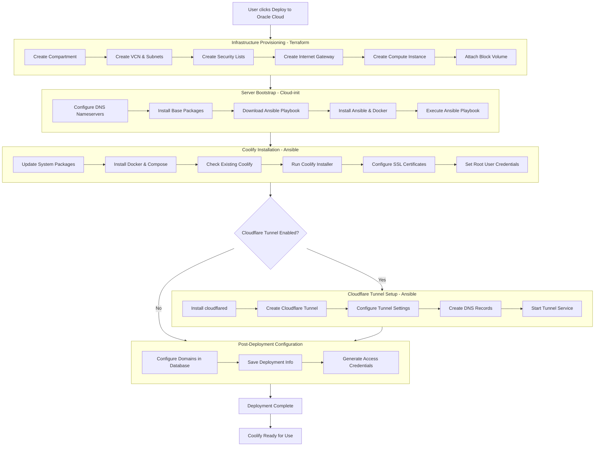

# VibeStack Coolify Deployment Workflow Flowchart

## Workflow Overview

This flowchart represents the complete VibeStack Coolify deployment workflow, which consists of four main phases:

1. **Infrastructure Provisioning**: Uses Terraform to create Oracle Cloud resources
2. **Server Bootstrap**: Uses cloud-init to prepare the Ubuntu server
3. **Coolify Installation**: Uses Ansible to install and configure Coolify
4. **Post-Deployment Configuration**: Final setup and credential generation

The workflow includes an optional Cloudflare Tunnel setup phase that runs conditionally based on user configuration.

## Key Decision Points

- **SSL Certificates**: Optional SSL certificate deployment from Cloudflare Origin certificates
- **Cloudflare Tunnel**: Optional secure tunnel setup for HTTPS access without public IP exposure

## Files Involved

- `schema.yaml`: Configuration schema and variable definitions
- `cloud-init-coolify.yaml`: Server bootstrap script
- `coolify-complete-setup.yml`: Ansible playbook for installation and configuration
- Terraform files: Infrastructure provisioning (`*.tf` files)